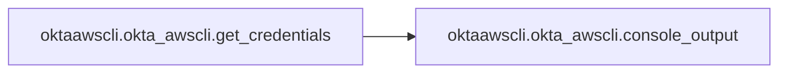
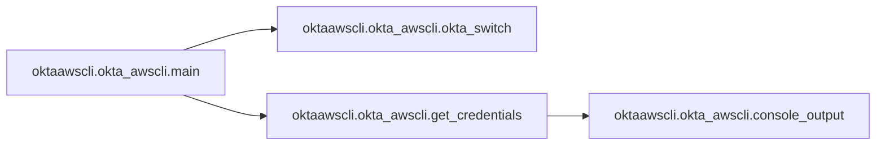

# Oktaawscli Okta Awscli

[_Documentation generated by Documatic_](https://www.documatic.com)

<!---Documatic-section-Codebase Structure-start--->
## Codebase Structure

<!---Documatic-block-system_architecture-start--->
```mermaid
None
```
<!---Documatic-block-system_architecture-end--->

# #
<!---Documatic-section-Codebase Structure-end--->

<!---Documatic-section-oktaawscli.okta_awscli.okta_switch-start--->
## oktaawscli.okta_awscli.okta_switch

<!---Documatic-section-okta_switch-start--->
<!---Documatic-block-oktaawscli.okta_awscli.okta_switch-start--->
<details>
	<summary><code>oktaawscli.okta_awscli.okta_switch</code> code snippet</summary>

```python
def okta_switch(logger):
    okta_profiles = sorted(OktaAuthConfig.get_okta_profiles())
    okta_profile_selected = 0 if len(okta_profiles) == 1 else None
    if okta_profile_selected is None:
        print('Available Okta profiles:')
        for (index, profile) in enumerate(okta_profiles):
            print('%d: %s' % (index + 1, profile))
        okta_profile_selected = int(input('Please select Okta profile: ')) - 1
        logger.debug(f'Selected {okta_profiles[okta_profile_selected]}')
    return okta_profiles[okta_profile_selected]
```
</details>
<!---Documatic-block-oktaawscli.okta_awscli.okta_switch-end--->
<!---Documatic-section-okta_switch-end--->

# #
<!---Documatic-section-oktaawscli.okta_awscli.okta_switch-end--->

<!---Documatic-section-oktaawscli.okta_awscli.get_credentials-start--->
## oktaawscli.okta_awscli.get_credentials

<!---Documatic-section-get_credentials-start--->


### Object Calls

* oktaawscli.okta_awscli.console_output

<!---Documatic-block-oktaawscli.okta_awscli.get_credentials-start--->
<details>
	<summary><code>oktaawscli.okta_awscli.get_credentials</code> code snippet</summary>

```python
def get_credentials(aws_auth, okta_profile, profile, verbose, logger, totp_token, cache, refresh_role, okta_username=None, okta_password=None):
    okta_auth_config = OktaAuthConfig(logger)
    okta = OktaAuth(okta_profile, verbose, logger, totp_token, okta_auth_config, okta_username, okta_password)
    (_, assertion) = okta.get_assertion()
    role = aws_auth.choose_aws_role(assertion, refresh_role)
    (principal_arn, role_arn) = role
    okta_auth_config.write_role_to_profile(okta_profile, role_arn)
    duration = okta_auth_config.duration_for(okta_profile)
    sts_token = aws_auth.get_sts_token(role_arn, principal_arn, assertion, duration=duration, logger=logger)
    access_key_id = sts_token['AccessKeyId']
    secret_access_key = sts_token['SecretAccessKey']
    session_token = sts_token['SessionToken']
    session_token_expiry = sts_token['Expiration']
    logger.info('Session token expires on: %s' % session_token_expiry)
    if not aws_auth.profile:
        exports = console_output(access_key_id, secret_access_key, session_token, verbose)
        if cache:
            cache = open('%s/.okta-credentials.cache' % (os.path.expanduser('~'),), 'w')
            cache.write(exports)
            cache.close()
        sys.exit(0)
    else:
        aws_auth.write_sts_token(access_key_id, secret_access_key, session_token)
```
</details>
<!---Documatic-block-oktaawscli.okta_awscli.get_credentials-end--->
<!---Documatic-section-get_credentials-end--->

# #
<!---Documatic-section-oktaawscli.okta_awscli.get_credentials-end--->

<!---Documatic-section-oktaawscli.okta_awscli.console_output-start--->
## oktaawscli.okta_awscli.console_output

<!---Documatic-section-console_output-start--->
<!---Documatic-block-oktaawscli.okta_awscli.console_output-start--->
<details>
	<summary><code>oktaawscli.okta_awscli.console_output</code> code snippet</summary>

```python
def console_output(access_key_id, secret_access_key, session_token, verbose):
    exports = '\n'.join(['export AWS_ACCESS_KEY_ID=%s' % access_key_id, 'export AWS_SECRET_ACCESS_KEY=%s' % secret_access_key, 'export AWS_SESSION_TOKEN=%s' % session_token])
    if verbose:
        print('Use these to set your environment variables:')
        print(exports)
    return exports
```
</details>
<!---Documatic-block-oktaawscli.okta_awscli.console_output-end--->
<!---Documatic-section-console_output-end--->

# #
<!---Documatic-section-oktaawscli.okta_awscli.console_output-end--->

<!---Documatic-section-oktaawscli.okta_awscli.main-start--->
## oktaawscli.okta_awscli.main

<!---Documatic-section-main-start--->


### Object Calls

* oktaawscli.okta_awscli.okta_switch
* oktaawscli.okta_awscli.get_credentials

<!---Documatic-block-oktaawscli.okta_awscli.main-start--->
<details>
	<summary><code>oktaawscli.okta_awscli.main</code> code snippet</summary>

```python
@click.command()
@click.option('-v', '--verbose', is_flag=True, help='Enables verbose mode')
@click.option('-V', '--version', is_flag=True, help='Outputs version number and sys.exits')
@click.option('-d', '--debug', is_flag=True, help='Enables debug mode')
@click.option('-f', '--force', is_flag=True, help='Forces new STS credentials. Skips STS credentials validation.')
@click.option('-o', '--okta-profile', help='Name of the profile to use in .okta-aws. If none is provided, then the default profile will be used.\n')
@click.option('-p', '--profile', help="Name of the profile to store temporary credentials in ~/.aws/credentials. If profile doesn't exist, it will be created. If omitted, credentials will output to console.\n")
@click.option('-c', '--cache', is_flag=True, help='Cache the default profile credentials to ~/.okta-credentials.cache\n')
@click.option('-r', '--refresh-role', is_flag=True, help='Refreshes the AWS role to be assumed')
@click.option('-t', '--token', help='TOTP token from your authenticator app')
@click.option('-l', '--lookup', is_flag=True, help='Look up AWS account names')
@click.option('-U', '--username', 'okta_username', help='Okta username')
@click.option('-P', '--password', 'okta_password', help='Okta password')
@click.option('--config', is_flag=True, help='Okta config initialization/addition')
@click.option('-s', '--switch', is_flag=True, default=False, is_eager=True, help='Switch to another okta profile and refresh the token')
@click.argument('awscli_args', nargs=-1, type=click.UNPROCESSED)
def main(okta_profile, profile, verbose, version, debug, force, cache, lookup, awscli_args, refresh_role, token, okta_username, okta_password, config, switch):
    if version:
        print(__version__)
        sys.exit(0)
    logger = logging.getLogger('okta-awscli')
    logger.setLevel(logging.DEBUG)
    handler = logging.StreamHandler()
    handler.setLevel(logging.WARN)
    formatter = logging.Formatter('%(levelname)s - %(message)s')
    handler.setFormatter(formatter)
    if verbose:
        handler.setLevel(logging.INFO)
    if debug:
        handler.setLevel(logging.DEBUG)
    logger.addHandler(handler)
    if config:
        OktaAuthConfig.configure(logger)
    if not okta_profile:
        okta_profile = 'default'
    if switch:
        okta_profile = okta_switch(logger)
    aws_auth = AwsAuth(profile, okta_profile, lookup, verbose, logger)
    if force or not aws_auth.check_sts_token():
        if force and profile:
            logger.info('Force option selected,                 getting new credentials anyway.')
        get_credentials(aws_auth, okta_profile, profile, verbose, logger, token, cache, refresh_role, okta_username, okta_password)
    if awscli_args:
        aws_auth.execute_aws_args(awscli_args, logger)
```
</details>
<!---Documatic-block-oktaawscli.okta_awscli.main-end--->
<!---Documatic-section-main-end--->

# #
<!---Documatic-section-oktaawscli.okta_awscli.main-end--->

[_Documentation generated by Documatic_](https://www.documatic.com)